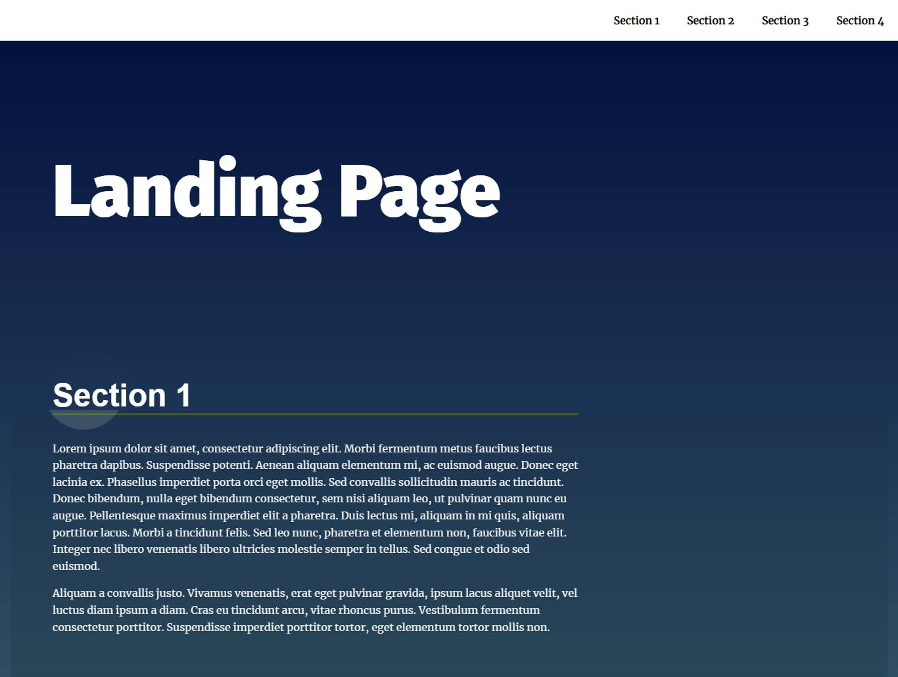

# Landing Page Project

> This is a solution to the landing page project udacity
## Table of contents

- [Overview](#overview)
- [The challenge](#the-challenge)
- [Screenshot](#screenshot)
- [Links](#links)
- [Built with](#built-with)
- [What I learned](#what-i-learned)
- [Useful resources](#useful-resources)
- [Author](#author)


## Overview

### The challenge

> build a multi-section landing page, with a dynamically updating navigational menu based on the amount of content that is added to the page.

## Screenshot



## Links

- Solution URL: [Landing page](https://landing-page-udacity2022.netlify.app/)

## Built with

- Semantic HTML5 markup
- CSS
- Mobile-first workflow
- Javascript

## What I learned
-  Build the navigation menu. This will dynamically create a navigation menu based on the sections of the page.
-  how add and remove class in ```classList``` and how to use ```.getBoundingClientRect()``` to Detect the element location relative to the viewport.
- how to write a professional ```README.md``` file.

## Useful resources

- [MDN](https://developer.mozilla.org/en-US/docs/Web/JavaScript?retiredLocale=ar)


## Author

- Linkedin - [Mohamed Hesham](https://www.linkedin.com/in/mohamed-hesham-b7611618a/)
